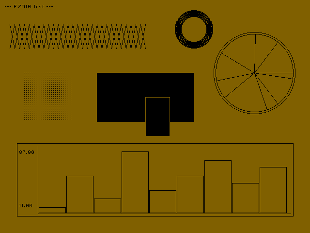
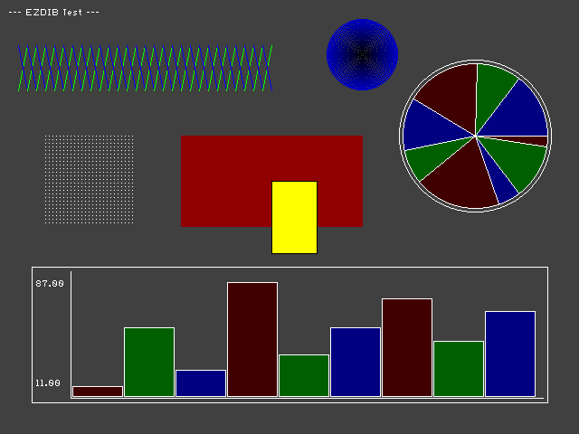

# ezdib — Easy DIB Drawing Library

A small, self-contained C library for creating and drawing into
[BMP](https://en.wikipedia.org/wiki/BMP_file_format) images.
It is designed to be easy to drop into any project — embedded, desktop,
or anywhere in between — with zero mandatory external dependencies.

---

## Table of Contents

- [Features](#features)
- [Example](#example)
- [Quick Start](#quick-start)
- [Building the Example](#building-the-example)
- [Core Concepts](#core-concepts)
- [API Reference](#api-reference)
- [Compile-time options](#compile-time-options)
- [Using your own pixel buffer](#using-your-own-pixel-buffer)
- [Custom pixel callback (unbuffered output)](#custom-pixel-callback-unbuffered-output)
- [Graph helpers](#graph-helpers)
- [Comparison to Similar Projects](#comparison-to-similar-projects)
- [License](#license)

---

## Features

- **Single-header + single-source** — drop `ezdib.h` and `ezdib.c` into your project and you're done
- **Three pixel formats**: 1 bpp monochrome, 24 bpp RGB, 32 bpp packed RGB with an unused high byte
- **Drawing primitives**: pixels, lines, rectangles (outline and fill), circles, arcs, flood fill
- **Image scaling** with three quality modes: nearest-neighbour, bilinear, and area averaging
- **Bitmap font rendering** with two built-in fonts (small and medium) and support for custom font maps
- **Load and save** uncompressed BMP files
- **Three math modes** selectable at compile time:
  - `EZD_MATH_CORDIC` *(default)* — built-in [CORDIC](https://en.wikipedia.org/wiki/CORDIC) algorithm, no `math.h` or `libm` required
  - `EZD_MATH_SYSTEM` — use `sin()`/`cos()` from the system `math.h`
  - `EZD_MATH_NONE` — arc drawing disabled; everything else still works
- **Custom pixel callback** — route every drawn pixel to your own function, enabling framebuffer, display driver, or ASCII-art output with no intermediate buffer
- **User-supplied buffers** — point the image data at memory you control (e.g. a hardware framebuffer) with no internal allocation
- **No global state** — all state lives in the image handle; multiple images can be used concurrently

---

## Example

### 1 BPP (1-bit) image


### 32 BPP (32-bit) image


---

## Quick Start

```c
#include "ezdib.h"

int main(void)
{
    /* Create a 320×240 24-bpp image */
    HEZDIMAGE img = ezd_create(320, -240, 24, 0);

    /* Fill background dark grey */
    ezd_fill(img, 0x404040);

    /* Draw a white circle */
    ezd_circle(img, 160, 120, 80, 0xffffff);

    /* Draw a red line */
    ezd_line(img, 0, 0, 319, 239, 0x0000ff);

    /* Render some text */
    HEZDFONT font = ezd_load_font(EZD_FONT_TYPE_MEDIUM, 0, 0);
    ezd_text(img, font, "Hello, world!", -1, 10, 10, 0xffffff);
    ezd_destroy_font(font);

    /* Save to disk */
    ezd_save(img, "output.bmp");
    ezd_destroy(img);
    return 0;
}
```

Compile (no extra flags needed in CORDIC mode):

```sh
gcc -o demo demo.c ezdib.c
```

---

## Building the Example

The repository includes a `main.c` demo and a CMake build:

```sh
cmake -B build
cmake --build build
./build/test_ezdib
```

### Math mode

```sh
# Default — CORDIC, no libm dependency
cmake -B build -DEZD_MATH_MODE=CORDIC

# System math.h (links libm)
cmake -B build -DEZD_MATH_MODE=SYSTEM

# No arc drawing at all
cmake -B build -DEZD_MATH_MODE=NONE
```

### Running the tests

```sh
cmake -B build
cmake --build build
ctest --test-dir build
```

For verbose output on any failure:

```sh
ctest --test-dir build --output-on-failure
```

The suite contains 69 tests covering image lifecycle, all drawing
primitives, font rendering, image scaling, math utilities, and
robustness (NULL handles, out-of-bounds coordinates, unsupported formats).
Each test is registered individually with CTest so failures are pinpointed
by name in the output.

---

## Core Concepts

### Color format

All colors are packed integers in `R | (G << 8) | (B << 16)` order:

```c
int red   = 0x0000ff;   /* R=255, G=0,   B=0   */
int green = 0x00ff00;   /* R=0,   G=255, B=0   */
int blue  = 0xff0000;   /* R=0,   G=0,   B=255 */
int white = 0xffffff;
int black = 0x000000;
```

> **Note:** This is the same byte order as the Windows `COLORREF` type and
> matches the in-memory layout of a 24 bpp BMP scan line on a little-endian
> machine.

### Image orientation

Pass a **negative height** to `ezd_create` or `ezd_initialize` to store
the image top-down (origin at top-left, y increases downward), which is
the natural orientation for screen coordinates.  A positive height stores
the image bottom-up, which is the default for BMP files.  Pixel and shape
drawing use the same coordinate system regardless of the sign.  Text
rendering also accounts for image orientation; use `EZD_FONT_FLAG_INVERT`
if you need to flip the glyph row direction explicitly.

```c
HEZDIMAGE top_down   = ezd_create(640, -480, 24, 0);  /* y=0 is top */
HEZDIMAGE bottom_up  = ezd_create(640,  480, 24, 0);  /* y=0 is bottom */
```

### Supported bit depths

| `bpp` | Description | Notes |
|-------|-------------|-------|
| `1`   | 1 bpp monochrome | Uses a 2-entry palette; pixels are set/cleared based on a configurable threshold |
| `24`  | 24 bpp RGB | 3 bytes per pixel, scan lines padded to a 4-byte boundary |
| `32`  | 32 bpp packed | 4 bytes per pixel, always 4-byte aligned; the top byte is unused by drawing functions |

---

## API Reference

### Image lifecycle

#### `ezd_create`

```c
HEZDIMAGE ezd_create(int width, int height, int bpp, unsigned int flags);
```

Allocates and initialises an image.  `bpp` must be 1, 24, or 32.
Pass a negative `height` for top-down orientation.

`flags` can include:
- `EZD_FLAG_USER_IMAGE_BUFFER` — do not allocate pixel memory; the caller
  will supply a buffer later with `ezd_set_image_buffer()` or
  `ezd_set_pixel_callback()`.

Returns `NULL` on failure (out of memory, invalid dimensions, unsupported
bpp, or if dimensions would overflow a 32-bit image size).

#### `ezd_initialize`

```c
HEZDIMAGE ezd_initialize(void *buffer, int buffer_size,
                         int width, int height, int bpp, unsigned int flags);
```

Like `ezd_create` but uses caller-supplied memory for the header instead
of `malloc`.  Useful on systems without dynamic allocation.  The buffer
must be at least `EZD_HEADER_SIZE` (128) bytes, or the exact value
returned by `ezd_header_size()`.

If `EZD_FLAG_USER_IMAGE_BUFFER` is set, `ezd_initialize` only needs the
header buffer and the pixel data must be supplied later with
`ezd_set_image_buffer()` or a pixel callback.  Without that flag, the
caller-owned buffer must also include room for the image data immediately
after the internal header (`ezd_header_size() + EZD_IMAGE_SIZE(width,
height, bpp, 4)`).

#### `ezd_destroy`

```c
void ezd_destroy(HEZDIMAGE img);
```

Frees all memory associated with the image.  Only frees memory that was
allocated by `ezd_create`; user-supplied header or pixel buffers are not
freed.

#### `ezd_save` / `ezd_load`

```c
int       ezd_save(HEZDIMAGE img, const char *path);
HEZDIMAGE ezd_load(const char *path);
```

Write or read an uncompressed
[BMP file](https://en.wikipedia.org/wiki/BMP_file_format).
Supports 1, 24, and 32 bpp.  The handle returned by `ezd_load` must be
released with `ezd_destroy`.  Both functions validate structure packing
at runtime so they will not silently produce corrupt files on platforms
with unusual alignment rules.

---

### Drawing primitives

All drawing functions accept an `HEZDIMAGE` handle and an integer color
value.  They return non-zero on success and zero on failure.  Invalid
handles, missing buffers, unsupported formats, or out-of-range single
pixel operations fail.  Multi-pixel primitives generally clip to the
image bounds; a fully off-screen line is treated as a successful no-op.

#### `ezd_set_pixel` / `ezd_get_pixel`

```c
int ezd_set_pixel(HEZDIMAGE img, int x, int y, int color);
int ezd_get_pixel(HEZDIMAGE img, int x, int y);
```

Set or read a single pixel.  For 1 bpp images, `ezd_set_pixel` compares
the color against the threshold set by `ezd_set_color_threshold`; colors
above the threshold set the bit, colors at or below clear it.

#### `ezd_line`

```c
int ezd_line(HEZDIMAGE img, int x1, int y1, int x2, int y2, int color);
```

Draws a 1-pixel-wide line between two points.

**Algorithm:**
[Bresenham's line algorithm](https://en.wikipedia.org/wiki/Bresenham%27s_line_algorithm)
with
[Cohen–Sutherland clipping](https://en.wikipedia.org/wiki/Cohen%E2%80%93Sutherland_algorithm)
applied first.

Clipping computes a 4-bit outcode for each endpoint — one bit per image
edge (top, bottom, left, right).  If both outcodes are zero the line is
trivially inside and no clipping is needed.  If their bitwise AND is
non-zero both endpoints are on the same outside half-plane and the line
is trivially invisible.  Otherwise one endpoint is moved to an edge
intersection using integer arithmetic.  After at most four such clips the
line is guaranteed to lie within the image.

The clipped line is then drawn with the standard Bresenham algorithm,
which avoids floating-point by tracking a cumulative error term and
stepping one pixel at a time.  The inner loop has no per-pixel bounds
check, which is the key performance benefit of pre-clipping.

#### `ezd_rect` / `ezd_fill_rect`

```c
int ezd_rect     (HEZDIMAGE img, int x1, int y1, int x2, int y2, int color);
int ezd_fill_rect(HEZDIMAGE img, int x1, int y1, int x2, int y2, int color);
```

`ezd_rect` draws the four edges of a rectangle by calling `ezd_line`.

`ezd_fill_rect` fills the rectangle, including both endpoint coordinates.
The first scan line is filled using a doubling-copy strategy: one pixel is
written by hand, then repeatedly
`memcpy`'d to fill 2, 4, 8 … pixels until the row is complete.  This
reaches the full `memcpy` throughput in O(log width) passes rather than a
per-pixel loop.  Subsequent rows are copied from the first row with a
single `memcpy` each.

#### `ezd_circle`

```c
int ezd_circle(HEZDIMAGE img, int cx, int cy, int radius, int color);
```

Draws the outline of a circle.

**Algorithm:**
[Midpoint circle algorithm](https://en.wikipedia.org/wiki/Midpoint_circle_algorithm)
(also called Bresenham's circle algorithm).

The algorithm walks one octant from the top of the circle to the 45°
diagonal, producing a pair (cx, cy) of offsets per step.  Each step
plots eight symmetric pixels, covering all octants simultaneously, at
no extra computation cost.  The decision to move the y coordinate inward
is driven by a single integer error term that is updated with additions
only — no multiplication, division, square root, or trigonometry.  This
makes it very fast even without a math library.

Radius 0 draws a single pixel via `ezd_set_pixel`.

#### `ezd_arc`

```c
int ezd_arc(HEZDIMAGE img, int cx, int cy, int radius,
            double start_angle, double end_angle, int color);
```

Draws a circular arc from `start_angle` to `end_angle` (in radians,
measured clockwise from the positive x-axis).

**Algorithm:**
The arc is sampled at `4π × radius` evenly spaced angle steps.  Rather
than computing `sin`/`cos` from scratch at every step, the code uses an
incremental rotation approach related to
[digital differential analyzer rasterization](https://en.wikipedia.org/wiki/Digital_differential_analyzer_%28graphics_algorithm%29):
it precomputes the sin and cosine of a single small step angle, then
rotates the current direction vector by that angle each iteration using
the identities:

```
cos(a + da) = cos(a)·cos(da) − sin(a)·sin(da)
sin(a + da) = sin(a)·cos(da) + cos(a)·sin(da)
```

This reduces the entire arc to **two** `sin`/`cos` evaluations at setup
time plus four multiplications and two additions per sample, regardless
of arc length.

The two setup evaluations use `EZD_SINCOS`, which is dispatched to either
the built-in CORDIC implementation or `math.h` depending on the
compile-time `EZD_MATH_MODE` setting.

#### `ezd_flood_fill`

```c
int ezd_flood_fill(HEZDIMAGE img, int x, int y, int border_color, int fill_color);
```

Fills a connected region starting at (x, y).  The fill spreads to any
neighbouring pixel that is neither the `border_color` nor the `fill_color`.

**Algorithm:**
[Scanline flood fill](https://en.wikipedia.org/wiki/Flood_fill#Span_filling).

A seed pixel is pushed onto a stack.  The main loop pops a seed, scans
left and right to find the full extent of the horizontal span, fills the
entire span in one pass (sequential memory writes, cache-friendly), then
pushes one seed per contiguous unfilled run in the rows immediately above
and below.  A separate visited bitmap ensures no pixel is examined twice.

This is substantially faster than a naive pixel-at-a-time depth-first
search for two reasons: horizontal spans are filled with a single memory
sweep, and the stack depth is proportional to the perimeter of the filled
region rather than its area.

> **Limitation:** Only supported for 24 and 32 bpp images.  1 bpp support
> is not yet implemented.

---

### Image scaling

```c
int ezd_scale(HEZDIMAGE src, int sx1, int sy1, int sx2, int sy2,
              HEZDIMAGE dst, int dx1, int dy1, int dx2, int dy2,
              unsigned int quality);
```

Scales the rectangle `(sx1,sy1)–(sx2,sy2)` of `src` into the rectangle
`(dx1,dy1)–(dx2,dy2)` of `dst`.  Source and destination can be different
sizes — that is what drives the scaling.  Both coordinates are inclusive.
Source and destination must have the same bit depth and must be different
image objects.

Taking explicit rectangles rather than just handles means a single call
can crop, scale, and place in one pass, which is useful for thumbnail
generation and sprite compositing.

`quality` selects the algorithm:

| Constant | Value | Algorithm |
|----------|-------|-----------|
| `EZD_SCALE_NEAREST`  | 0 | Nearest-neighbour |
| `EZD_SCALE_BILINEAR` | 1 | Bilinear interpolation |
| `EZD_SCALE_AREA`     | 2 | Area averaging |

#### Nearest-neighbour (`EZD_SCALE_NEAREST`)

Each destination pixel is assigned the colour of the single closest source
pixel.  No blending.  A 16.16
[fixed-point](https://en.wikipedia.org/wiki/Fixed-point_arithmetic)
step counter is used so the inner loop is a single addition — no division
per pixel.

Works for all three bit depths including 1 bpp (the only mode that makes
sense for 1 bpp, since blending monochrome bits has no meaning).  Fast
enough for real-time use; produces blocky results when upscaling and can
alias when downscaling significantly.

#### Bilinear (`EZD_SCALE_BILINEAR`)

Each destination pixel maps to a fractional source position.  The four
surrounding source pixels are blended using weights proportional to their
distance from that position — the
[bilinear interpolation](https://en.wikipedia.org/wiki/Bilinear_interpolation)
formula.

Weights are kept as 8-bit integers (0–256) to avoid floating-point in the
inner loop.  The four weights always sum to exactly 65536, so the result
is `(sum + 32768) >> 16` — correct half-up rounding.  The maximum
intermediate value per channel is `255 × 256 × 256 × 4 = 66,846,720`,
which fits comfortably in a signed 32-bit integer.

Produces smooth results when upscaling and for mild downscaling (≤ ~2×).
For larger scale-down ratios, use area averaging.

#### Area averaging (`EZD_SCALE_AREA`)

Each destination pixel covers a rectangle of source pixels.  Every source
pixel contributes a weight equal to its fractional area of overlap with
that rectangle, computed from 16.16 fixed-point boundary coordinates.
All channel values and weights are accumulated in `long long` to handle
large scale-down ratios without overflow (safe up to roughly 4096×4096
source images).

This is equivalent to applying a
[box filter](https://en.wikipedia.org/wiki/Box_blur) before sampling,
which reduces aliasing when shrinking an image.  It is the best choice
whenever the destination is smaller than the source.  When both
destination dimensions are at least as large as the source dimensions,
this mode automatically falls back to bilinear.

```c
/* Load a large photo, produce a 128×128 thumbnail */
HEZDIMAGE photo     = ezd_load("photo.bmp");
HEZDIMAGE thumbnail = ezd_create(128, -128, 24, 0);

int w = ezd_get_width(photo),  h = EZD_ABS(ezd_get_height(photo));

ezd_scale(photo,     0, 0, w-1, h-1,
          thumbnail, 0, 0, 127, 127,
          EZD_SCALE_AREA);

ezd_save(thumbnail, "thumb.bmp");
ezd_destroy(photo);
ezd_destroy(thumbnail);
```

---

### Font rendering

#### `ezd_load_font` / `ezd_destroy_font`

```c
HEZDFONT ezd_load_font(const void *font_table, int table_size, unsigned int flags);
void     ezd_destroy_font(HEZDFONT font);
```

Loads a font from a compact bitmap table.  Three built-in fonts are
available:

| Constant | Glyph height | Description |
|----------|-------------|-------------|
| `EZD_FONT_TYPE_SMALL`  | 6 px | Compact, fits tight spaces |
| `EZD_FONT_TYPE_MEDIUM` | 10 px | General-purpose |
| `EZD_FONT_TYPE_LARGE`  | — | Not yet implemented, returns NULL |

Pass one of those constants as the first argument and `0` for the size
and flags to load a built-in font:

```c
HEZDFONT f = ezd_load_font(EZD_FONT_TYPE_MEDIUM, 0, 0);
```

`flags` may include `EZD_FONT_FLAG_INVERT` to flip the rendering
direction (useful when combining with a positive-height image).
Custom font tables must pass a positive `table_size` so malformed input
can be rejected without reading beyond the supplied buffer.

**Font table format:**
Each glyph entry is: `[char_code, width, height, bitmap_bytes…]`.
The bitmap is a flat, MSB-first bitstream packed without any per-row
padding — rows flow continuously across byte boundaries.  The table is
terminated by a zero byte.  The first entry in the table acts as the
default/fallback glyph for any character not explicitly listed.

#### `ezd_text` / `ezd_text_size`

```c
int ezd_text(HEZDIMAGE img, HEZDFONT font, const char *text, int len,
             int x, int y, int color);
int ezd_text_size(HEZDFONT font, const char *text, int len, int *w, int *h);
```

`ezd_text` renders a string into the image at (x, y).  Pass `len = -1`
for a null-terminated string.  Newline (`\n`) and carriage-return (`\r`)
characters are handled.  Glyphs that fall partially or fully outside the
image boundary are skipped.

`ezd_text_size` computes the bounding box of a string without drawing,
useful for centering or wrapping text.

---

### Math utilities

```c
double ezd_sin(double radians);
double ezd_cos(double radians);
```

Compute sine and cosine using whichever math backend was compiled in.
These are exposed so application code can share the same implementation
and avoid linking `libm` separately when using CORDIC mode.

**CORDIC algorithm:**
[CORDIC](https://en.wikipedia.org/wiki/CORDIC) (COordinate Rotation
DIgital Computer) computes trigonometric functions using only addition,
subtraction, and bit-shifts — no floating-point multiply hardware is
strictly required (though the implementation here uses `double` for
accuracy).

The algorithm iteratively rotates a unit vector toward the target angle
using pre-computed table entries `atan(2⁻ⁱ)` for i = 0…19.  Each
iteration doubles the precision.  After 20 iterations the result is
accurate to approximately 6 decimal digits — more than sufficient for
sub-pixel-accurate drawing.

The implementation pre-scales the initial vector by the inverse CORDIC
gain (K ≈ 0.6073) so that the output is a unit vector directly, with no
division step needed.

---

### Compile-time options

These `#define` symbols can be set before including `ezdib.h`, passed on
the compiler command line (`-D`), or added to `ezdib.c` in the
**Config** section near the top.

| Symbol | Effect |
|--------|--------|
| `EZD_MATH_CORDIC` | *(default)* Use built-in CORDIC for `sin`/`cos`; no `math.h` or `libm` needed |
| `EZD_MATH_SYSTEM` | Use `sin()`/`cos()` from `math.h`; links `libm` |
| `EZD_MATH_NONE`   | Disable arc drawing; `ezd_arc` returns 0; `ezd_circle` still works |
| `EZD_NO_MATH`     | Legacy alias for `EZD_MATH_NONE` |
| `EZD_NO_ALLOCATION` | Remove all `malloc`/`free` usage; `ezd_create` and `ezd_flood_fill` will not work, but `ezd_initialize` still does |
| `EZD_NO_FILES`    | Remove all `fopen`/`fread`/`fwrite` usage; `ezd_save` and `ezd_load` will not work |
| `EZD_NO_MEMCPY`   | Replace `memcpy`/`memset` with internal byte loops (for systems without `string.h`) |
| `EZD_STATIC_FONTS` | Skip font index allocation; font lookup is slower but uses no heap |

---

### Using your own pixel buffer

By default `ezd_create` allocates the pixel buffer with `malloc`.
If you want to use memory you control — for example, a hardware
framebuffer or a statically allocated array — use `EZD_FLAG_USER_IMAGE_BUFFER`:

```c
static char header[EZD_HEADER_SIZE];
static char pixels[320 * 240 * 3];   /* 24 bpp */

HEZDIMAGE img = ezd_initialize(header, sizeof(header), 320, -240, 24,
                               EZD_FLAG_USER_IMAGE_BUFFER);
ezd_set_image_buffer(img, pixels, sizeof(pixels));

/* draw … */

/* No ezd_destroy needed if you manage the memory yourself, but calling it
   is safe — it only frees memory that ezdib itself allocated. */
```

---

### Custom pixel callback (unbuffered output)

For display drivers, ASCII-art renderers, dot-matrix displays, or any
target that cannot hold a full frame buffer, you can install a callback
that receives every pixel as it is drawn:

```c
int my_set_pixel(void *user, int x, int y, int color, int flags)
{
    /* write to your display, framebuffer, or buffer here */
    return 1;   /* return 0 to abort the current drawing operation */
}

/* Create a header-only image — no pixel buffer allocated */
char header[EZD_HEADER_SIZE];
HEZDIMAGE img = ezd_initialize(header, sizeof(header), 128, -64, 24,
                               EZD_FLAG_USER_IMAGE_BUFFER);
ezd_set_pixel_callback(img, my_set_pixel, my_display_context);

/* All drawing calls now route through my_set_pixel */
ezd_fill(img, 0x000000);
ezd_circle(img, 64, 32, 20, 0x00ff00);
```

The callback receives the character value of the current font glyph in
the `flags` field during text rendering.  Other drawing calls currently
pass `0` for that field.

---

### Graph helpers

Two utility functions support drawing data-driven graphs (used by
`main.c` for bar and pie charts):

```c
double ezd_scale_value(int index, int type, void *data,
                       double src_offset, double src_range,
                       double dst_offset, double dst_range);

double ezd_calc_range(int type, void *data, int count,
                      double *min_out, double *max_out, double *total_out);
```

`ezd_calc_range` scans an array of a supported numeric type and returns
the minimum, maximum, and sum.

`ezd_scale_value` maps one element of the array from the source range
into a destination range — useful for projecting data values onto pixel
coordinates.

`type` must be one of the implemented `EZD_TYPE_*` constants:
`EZD_TYPE_CHAR`, `EZD_TYPE_UCHAR`, `EZD_TYPE_SHORT`, `EZD_TYPE_USHORT`,
`EZD_TYPE_INT`, `EZD_TYPE_UINT`, `EZD_TYPE_LONGLONG`,
`EZD_TYPE_ULONGLONG`, `EZD_TYPE_FLOAT`, or `EZD_TYPE_DOUBLE`.

---

## Comparison to Similar Projects

Several libraries cover parts of the same space: BMP file I/O, small
software renderers, or broader image-processing toolkits.  The right
choice depends on whether you need plain C, BMP-only output, drawing
primitives, image processing, or support for many file formats.

---

### QDBMP

[QDBMP](https://qdbmp.sourceforge.net/) is a small C library for BMP file
I/O.  It consists of two source files, uses only the standard C library,
and supports uncompressed 8, 24, and 32 bpp BMP variants.

Key differences:

- QDBMP is focused on loading, creating, editing, and saving BMP images.
  It does not try to be a drawing-primitives library.
- QDBMP supports 8 bpp indexed BMP files; ezdib supports 1 bpp instead.
- ezdib includes drawing operations such as lines, rectangles, circles,
  arcs, flood fill, scaling, and bitmap text.
- Both projects are small C libraries with minimal dependencies.

Choose QDBMP if you mainly need simple BMP I/O in C, especially 8 bpp
BMP support.

Choose ezdib if you need to generate images procedurally with built-in
drawing primitives and can work with 1, 24, or 32 bpp uncompressed BMPs.

---

### EasyBMP

[EasyBMP](https://easybmp.sourceforge.net/) is a C++ BMP library designed
for reading, writing, and modifying uncompressed BMP files.  It supports
1, 4, 8, 16, 24, and 32 bpp BMP files.

Key differences:

- EasyBMP supports more BMP bit depths than ezdib.
- EasyBMP is C++; ezdib is C.
- EasyBMP is primarily a BMP I/O and pixel-editing library.  ezdib has a
  smaller BMP-format surface but includes drawing primitives and text.
- EasyBMP is documented for both little-endian and big-endian systems;
  ezdib writes BMP structs directly after runtime packing checks.

Choose EasyBMP if you are writing C++ and need broad uncompressed BMP
format support.

Choose ezdib if you need a small C renderer for generating BMPs from
primitives or drawing into a caller-supplied framebuffer.

---

### C++ Bitmap Library

The [C++ Bitmap Library](https://www.partow.net/programming/bitmap/idx.html)
is a single-header C++ library for 24 bpp BMP images.  It includes BMP
I/O, pixel access, drawing primitives, resizing, colour maps, texture
generation, and canvas-style helpers.

Key differences:

- C++ Bitmap Library has a broader image-processing and canvas feature
  set than ezdib.
- It is limited to 24 bpp BMP images; ezdib supports 1, 24, and 32 bpp.
- It is C++; ezdib is C and exposes an opaque handle API.
- ezdib has explicit support for user-supplied buffers and pixel
  callbacks, which is useful for embedded or display-driver targets.

Choose C++ Bitmap Library if you are using C++ and want a richer
single-header 24 bpp BMP toolkit.

Choose ezdib if you want a smaller C API, 1 bpp output, or unbuffered
pixel callbacks.

---

### BitmapPlusPlus

[BitmapPlusPlus](https://github.com/baderouaich/BitmapPlusPlus) is a
header-only C++ BMP library.  It supports 24 bpp RGB BMPs and includes
examples for pixel editing and drawing primitives.

Key differences:

- BitmapPlusPlus is header-only C++; ezdib is a C header plus source file.
- BitmapPlusPlus is centered on 24 bpp BMPs; ezdib supports 1, 24, and
  32 bpp.
- BitmapPlusPlus includes CMake/FetchContent integration.  ezdib is aimed
  at direct source inclusion and also has a small CMake demo/test build.
- ezdib includes font rendering, flood fill, scaling, and callback-based
  output in the core API.

Choose BitmapPlusPlus if you want a modern C++ header-only BMP helper
for 24 bpp images.

Choose ezdib if you need a C API or the specific 1 bpp, callback, and
embedded-oriented paths.

---

### CGL

[CGL](https://github.com/Jaysmito101/cgl) is a C graphics/game utility
library.  It is a single-header style project with optional components
for windowing, widgets, OpenGL rendering, text rendering, audio,
networking, math, and other utilities.

Key differences:

- CGL is a broad graphics/game-development toolkit.  ezdib is narrowly
  focused on BMP images and simple software drawing.
- CGL has optional windowing, widgets, OpenGL, FreeType text, audio, and
  networking components.  ezdib has no windowing or GPU layer.
- ezdib writes uncompressed BMP files directly and can draw into a
  caller-supplied pixel buffer or callback.  CGL is aimed more at
  interactive graphics, demos, and application/game experiments.
- Both projects are written in C and are designed to be embedded in
  small projects, but their scopes are very different.

Choose CGL if you want a broader C graphics toolkit with optional
windowing, widgets, GPU rendering, and game/demo utilities.

Choose ezdib if you only need deterministic software drawing into BMPs
or simple framebuffers.

---

### CImg

[CImg](https://cimg.eu/) is a much larger single-header C++ image
processing library.  It supports image loading, saving, display,
filtering, transforms, drawing primitives, text, and generic pixel types.
Optional dependencies add support for compressed formats and other
features.

Key differences:

- CImg is a general image-processing toolkit; ezdib is a small BMP
  drawing library.
- CImg supports many more operations and data models, including images
  with more dimensions and generic pixel types.
- CImg is C++; ezdib is C.
- ezdib is easier to audit and embed when the output target is just an
  uncompressed BMP or a simple framebuffer.

Choose CImg if you need substantial image processing, many algorithms,
or optional support for common compressed formats.

Choose ezdib if you need a small, dependency-light C library for drawing
simple raster output.

---

### GD Graphics Library

[GD](https://libgd.github.io/) is a mature C graphics library for dynamic
image creation.  It can draw shapes and text and can write common image
formats such as PNG and JPEG when built with the relevant dependencies.

Key differences:

- GD supports many more output formats and font/image features than
  ezdib.
- GD is a linked library with optional external dependencies.  ezdib is
  intended to be dropped into a project as one `.c` and one `.h` file.
- GD is a better fit for web/server-side image generation where PNG,
  JPEG, alpha blending, or richer text support matter.
- ezdib is a better fit for tiny tools, BMP-only output, and environments
  where external dependencies are undesirable.

Choose GD if you need production-grade dynamic image generation in common
web image formats.

Choose ezdib if BMP output is acceptable and small source-level
integration matters more than format breadth.

---

### Summary

| Project | Language | Main focus | File formats | Drawing primitives | Relative scope |
|---------|----------|------------|--------------|--------------------|----------------|
| ezdib | C | Small BMP drawing and framebuffer-style output | BMP: 1, 24, 32 bpp uncompressed | Yes | Small |
| QDBMP | C | Minimal BMP I/O | BMP: 8, 24, 32 bpp uncompressed | No | Small |
| EasyBMP | C++ | BMP I/O and pixel editing | BMP: 1, 4, 8, 16, 24, 32 bpp uncompressed | Limited / pixel-level | Small-medium |
| C++ Bitmap Library | C++ | 24 bpp BMP processing and drawing | BMP: 24 bpp | Yes | Medium |
| BitmapPlusPlus | C++ | Header-only 24 bpp BMP helper | BMP: 24 bpp | Yes | Small-medium |
| CGL | C | Graphics/game utility toolkit | Not BMP-focused | Yes | Large |
| CImg | C++ | General image processing | Many, depending on build/options | Yes | Large |
| GD | C | Dynamic image generation | PNG/JPEG/GIF/WebP/etc. depending on build | Yes | Medium-large |

---

## License

BSD-style license — see `LICENSE` and the header of `ezdib.h` for the
full text.  Redistribution in source and binary forms is permitted for
commercial and non-commercial use, provided the copyright notice is
retained.

Copyright (c) 1997–2012 Robert Umbehant
